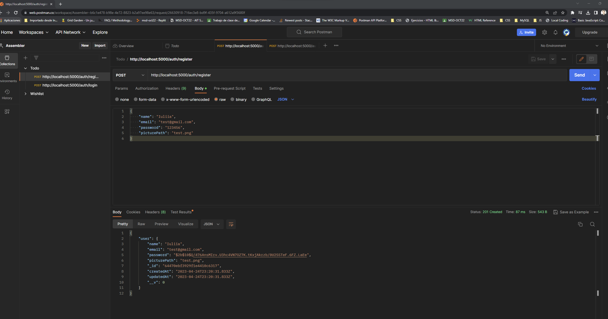
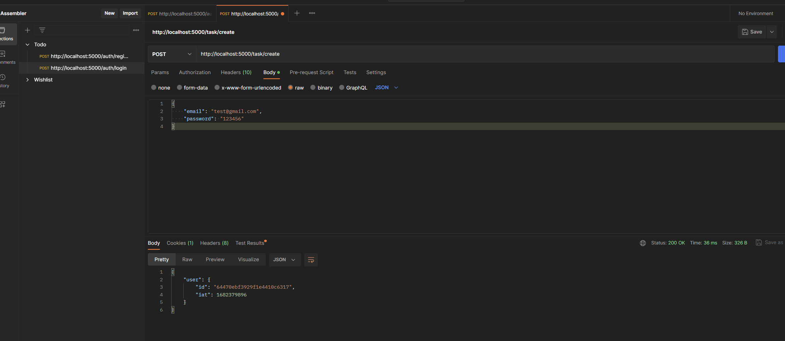
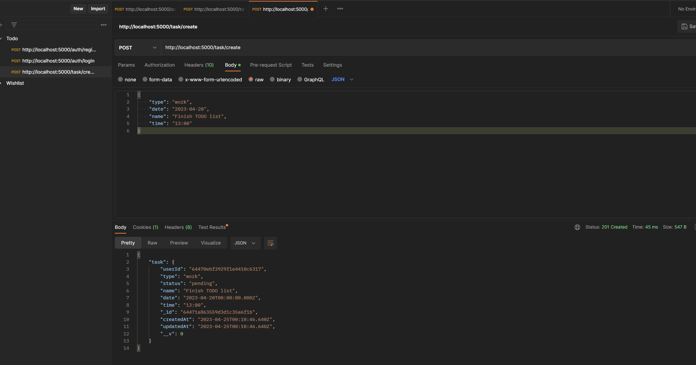
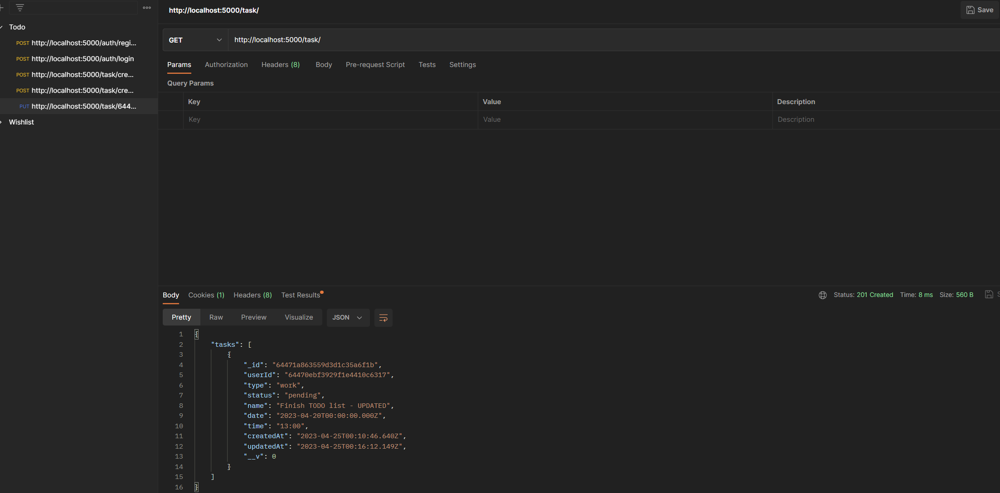
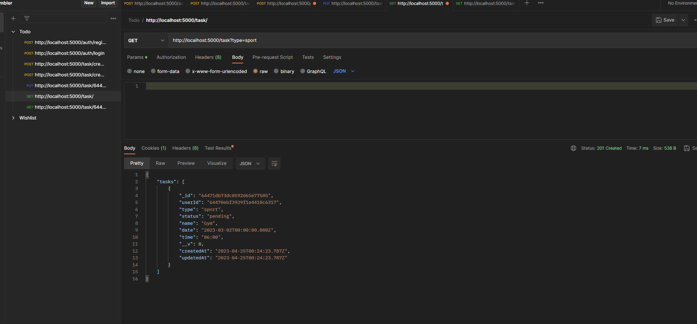
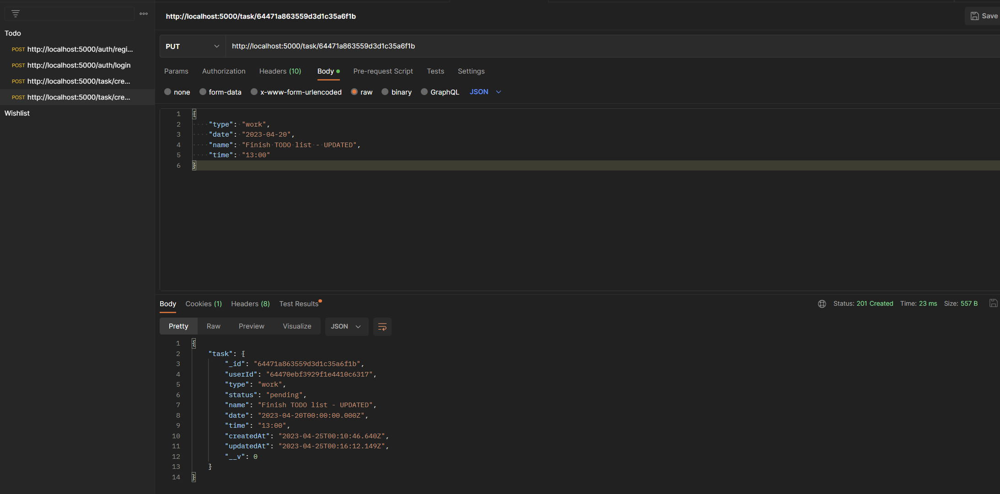

# BACKEND para TODO CRUD 

El objetivo principal de este proyecto fue **entender los conceptos basicos de backend y aprender preparar el servidor y endpoint** para la futura implementacion en el parte de Front-end.

## Descripcion

Este es un proyecto de backend para una aplicación de tareas que utiliza:
- Node.js, 
- MongoDB, 
- Express, 
- JWT para la autenticación y protección del contenido. 
Solo los usuarios registrados y autorizados tienen acceso al contenido protegido.

## Requisitos previos

Antes de comenzar con la instalación, asegúrese de tener instalados los siguientes programas en su sistema:

+ Node.js (v14 o superior)
+ MongoDB ( y Atlas para futura gestion)

Mas necesitaras una cuenta activa en **Postman** para comprobal los endpoints y sus respuestas

## Instalación

1. Clonar este repositorio en su computadora.
2. Navegar a la carpeta del proyecto en la línea de comandos 
```cd {nomre de la carpeta}```
3. Ejecutar el comando ```npm install``` para instalar todas las dependencias.
4. Crear un archivo *.env* en la raíz del proyecto y establecer los valores de las siguientes variables de entorno:
```
PORT={YPUR_PORT} --> eliges tu 
MONGODB_URI={YOUR_MD_URL} --> mira en Atlas 
JWT_SECRET={SuClaveSecretaDeJWT} --> lo creas tu
```
5. Ejecutar el comando ```npm start``` para iniciar el servidor.

### Uso

El servidor estará escuchando en el puerto especificado en la variable de entorno PORT. Las rutas disponibles son las siguientes:

**Autenticación**

| Método  | Ruta             | Descripción                        |
| --------| -----------------|------------------------------------|
| POST    | '/auth/register' |Registra un nuevo usuario           |
| POST    | '/auth'          |Inicia sesión y devuelve un token JW|

**Tareas**

| Método  | Ruta             | Descripción |
| --------| -----------------|-------------|
| POST    | '/task/create'   |CreateTask   |
| PUT     | '/task/:id'      |UpdateTask   |
| GET     | '/task/:id'      |GetTask      |
| GET     | '/task'          |GetTasks     |
| DELETE  | '/task/:id'      |DeleteTask   |

### Postman
Sing up user

Return token

Create task

Get task

Get task with query

Update task


### In progress
- Autenticación con Auth0


